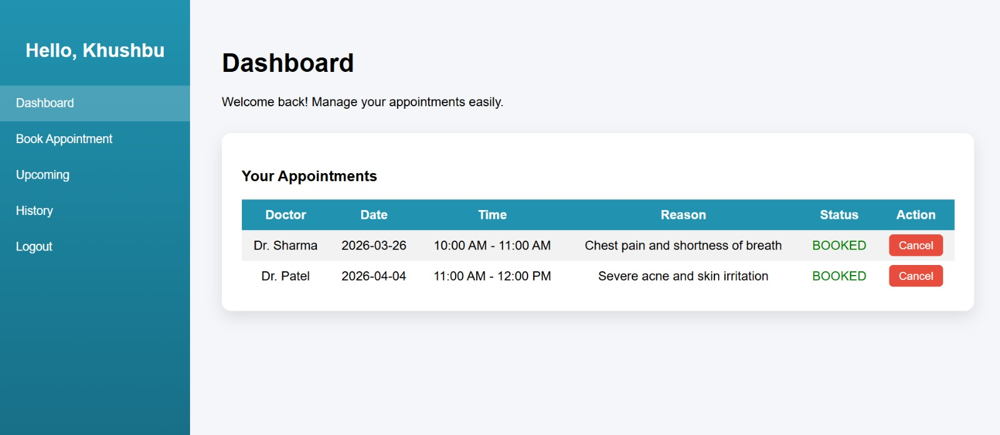
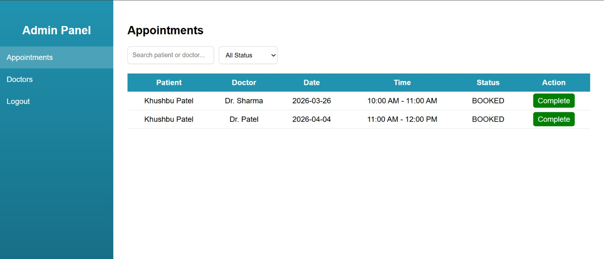

# 🏥 Appointment Booking System

A full-stack web application that allows users to register, login, view doctors, and book appointments. Built using **Java (JSP/Servlets)**, **MySQL**.

---

## Links

1. Youtube Demo Video:
```text
https://youtu.be/Q-iE_L3CNxE?si=vtHcTmJtBJDzmM0K
```

2. API Documentation (Postman):
```text
https://documenter.getpostman.com/view/39216679/2sBXwtoor5
```

---

## 📷 Preview

User Dashboard


Admin Panel


---

## 🚀 Features

* 👤 User Registration & Login
* 👨‍⚕️ View Doctors with Specialization & Fees
* 📅 Book Appointments
* 📋 View Appointment Details
* 🔐 Secure Database with Foreign Key Relationships

---

## 🛠️ Tech Stack

* **Frontend:** HTML, CSS, JSP
* **Backend:** Java Servlets
* **Database:** MySQL
* **Server:** Apache Tomcat

---

## 🗂️ Database Schema

### 🔹 Users Table

* id (PK)
* name
* email (unique)
* password

### 🔹 Doctors Table

* id (PK)
* name
* specialization
* fees

### 🔹 Appointments Table

* id (PK)
* patient_name
* doctor_id (FK)
* user_id (FK)
* appointment_date
* time_slot
* phone
* reason
* status

---

## ⚙️ Environment Variables

The application uses environment variables for database connection. For local development, use a local MySQL database:

```env
DB_URL=jdbc:mysql://localhost:3306/appointment_db?useSSL=false&allowPublicKeyRetrieval=true&serverTimezone=UTC
DB_USER=root
DB_PASS=<your_password>
```

> If you use Windows PowerShell for a session:
>
> ```powershell
> $env:DB_URL = 'jdbc:mysql://localhost:3306/appointment_db?useSSL=false&allowPublicKeyRetrieval=true&serverTimezone=UTC'
> $env:DB_USER = 'root'
> $env:DB_PASS = 'your_password'
> ```

---

## 🧩 How to Run Locally

1. Clone the repository:

```bash
git clone https://github.com/your-username/appointment-booking-system.git
```

2. Import into IDE (Eclipse/IntelliJ) or run from the terminal

3. Configure MySQL:

```sql
CREATE DATABASE appointment_db;
```

4. Create the tables and seed any initial data using your SQL script or schema

5. Copy `.env.example` to `.env` and update the values:

```powershell
copy .env.example .env
```

6. Run the application from the project root:

```bash
mvn tomcat7:run
```

7. Access the web app in your browser:

```text
http://localhost:8080/appointment
```

---

## 🔮 Future Enhancements

* Payment Integration
* Email Notifications
* Responsive UI
